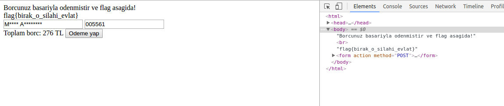

## Hacktrick16 Web Güvenliği Eğitimi 

Uzun ve bol eğitimli geçen bir cumartesi sonrası pazar günü saat 10.00'da CTF'e başladık.
Web kategorisinden 5 soru bulunan bu CTF'in sorularını ve çözümlerini aşağıdaki bulabilirsiniz.

*Hocalarımız [**Mustafa Altınkaynak**](http://www.altinkaynak.biz/)'a ve [**Mazlum Ağar**](http://www.mazlumagar.com/)'a emekleri için çok teşekkürler .*

------

### CTF Soruları & Çözümleri

#### • Web 1

Bu soruda Mustafa hocamızın websitesini barındırdığı hosting firması soruluyordu.
Domain'e whois çektiğinizde ise website alt yapısının **CLoudFlare** tarafından korunduğunu ve bu yüzden name serverlarının hangi firmaya ait olduğunu bulamıyordunuz.

İlk ipucumuz **"Cevap CloudFlare değil"** den sonra canım sıkıldı ve brute force yapmak istedim. Türkiye'deki popüler şirketleri tek tek denerken 3. seferde tutturdum :)

Sorunun çözümü ise : CloudFlare'in name serverlarını gizlediği siteleri açığa çıkaran **Crime Flare** isimli bir oluşum.
Bu site üzerinden altinkaynak.biz  aratıldığı zaman hosting firmasının ve flag'ımızın **Alastry** olduğunu bulabilirdik.

=====
#### • Web 2

Soruda verilen URL'e girildiği zaman bizi aşağıdaki gibi bir hata karşılıyordu :

Siteyle yapılan bağlantı sürekli resetleniyor, bizde bu yüzden html dosyasına ulaşamıyorduk.
Derste öğrendiğimiz dosya adını engelleme konusunu düşündüm ve URL'deki **admin.html** kısmını **%61dmin.html** şeklinde decode ettim ve sonuca ulaştım.
> *%61 = "a" in HEX Code*

=====
#### • Web 3

Bu soruda meşhur ***"There is no place like 127.0.0.1"*** sözünün localhost ip adresi hariç olan kısmı ve bir URL bizi bekliyordu.

Linke tıkladığınızda ise sadece *"There is no place like"* sözüne ulaşabiliyordunuz. Sözdeki ip kısımlı bölümü alıp hocamızın verdiği
**ip spoof** ipucu sayesinde ne yapmamız gerektiğini çözdüm. Sisteme ip adresimizi "127.0.0.1" şeklinde tanıtıp öyle girmeliydik.
Bunun için bir ***Firefox eklentisi olan "x-forwarded-for"*** veya bir ***Chrome eklentisi olan ModHeader***'ı indirip ip adresini değiştirince bu flag'a ulaşıyorduk :

=====
#### • Web 4

Soruda verilen URL'e girdiğiniz zaman meşhur mesajlaşma uygulaması **Telegram**'ın ikonuyla karşılaşıyordunuz.
Hemen altında verilen **hacktrick_WebApp_Level4**'un bir bot olabileceğini düşündüm ve telefonumdan botu ekledim.
Haklıydım, gerçekten böyle bir bot vardı :D

flag kelimesi dışında yazdığınız herşeye ***"Ben var seni anlayamamak Alpay :("*** şeklinde cevap veren botumuz nedense flag yazınca ***"Merhaba, acelen ne Alpay Can?"*** şeklinde farklı bir cevap veriyordu.
Bundan kuşkulanarak **"flag.txt"** komutunu yazdığımda ise yine bir sonuçla karşılaşamadım. Hocamızdan da **"linuxta gibi düşünün"** ipucusunu alınca bota sormam gereken doğru soruyu buldum :

> **"cat flag.txt"** ==> Tebrikler Alpay, flag{ekinler_bas_vermeden_kor_buzagi_topallamazmis}

=====
#### • Web 5

Soruda verilen linke girerek hemen hocamızın borçlarını ödemeye çalıştık :)

Karşılaştığımız ekranda önceden **placeholder'ları tanımlanmış 2 tane input alanı** ile karşılaştık.
Ödeme yap'a bastığımız zaman sadece ***"Tebrikler, borcunuz başarıyla ödenmiştir"*** yazısını alıyor ve flag'i bulamıyorduk.

Daha sonra sayfa kaynağını incelerken gizlenmiş (hidden) bir input tag'ı farkettim, adı'da borç idi.
Value kısmında yazan uzun kod bana **md5** ile şifrelenmiş bir kod gibi geldi.
Test etmek için online **md5 generatorlar**dan birine girip kodu yazdım ve **276** rakamıyla karşılaştım.

Sayfaya geri döndüğümde ise hocamızın da borcunun 276 olduğunu farkettim. Borcu sıfırlamak için hemen **0 rakamının md5 kodunu aldım** ( cfcd208495d565ef66e7dff9f98764da ), 
öğeyi denetle'den sayfadaki kod ile değiştirdim ve borcu öde'ye bastım. Ta daaa :

